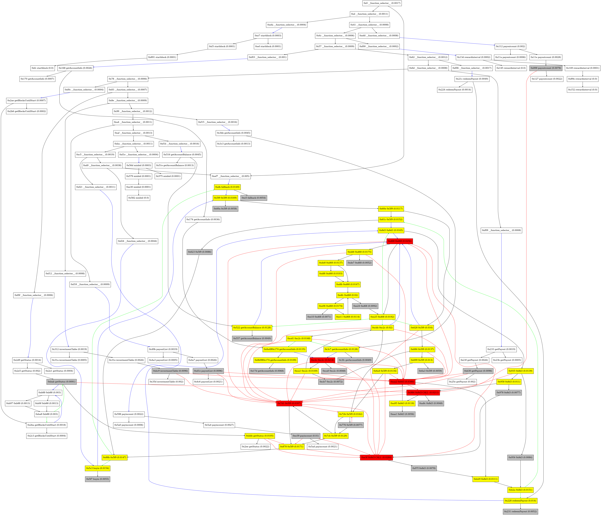
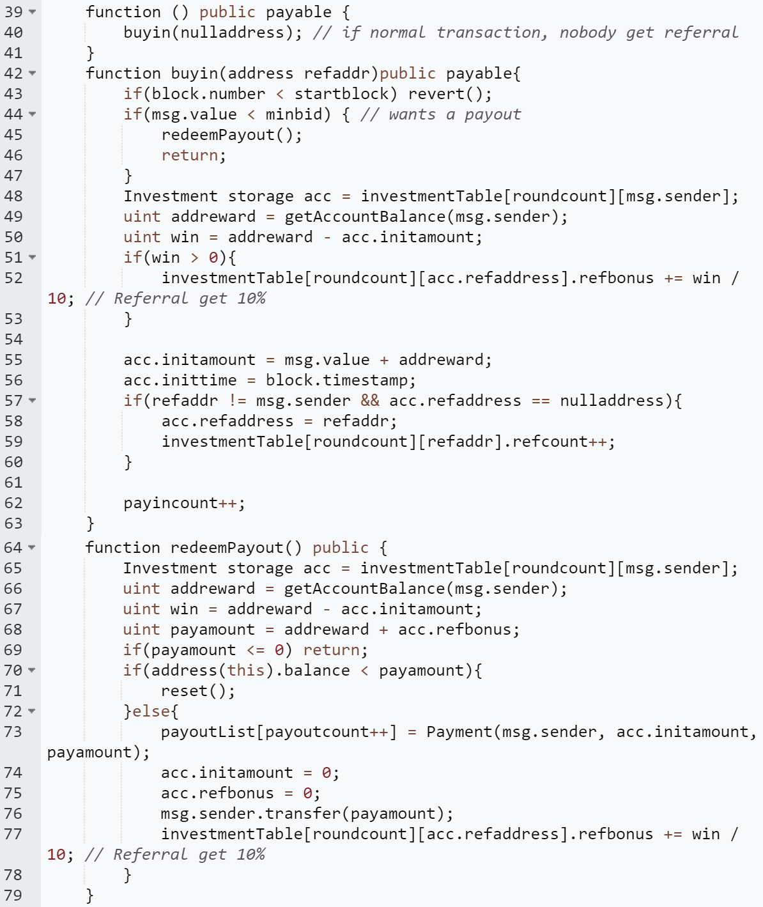
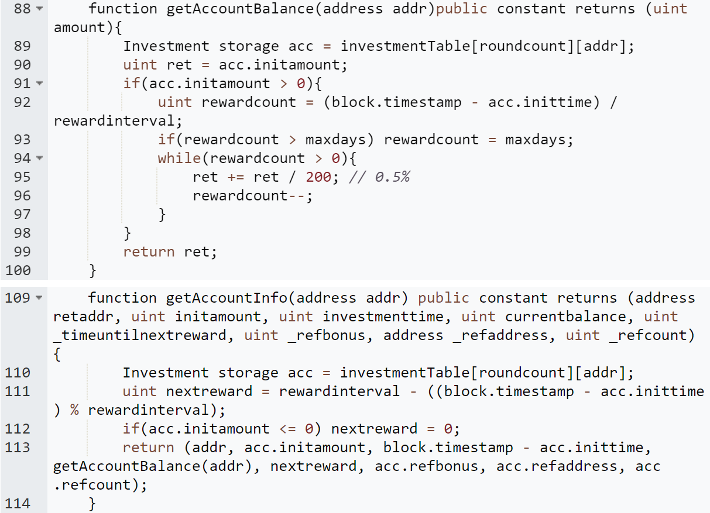

## PonziHunter

This repository contains the source code of the paper "PonziHunter: Hunting Ethereum Ponzi Contract via Contrastive Learning on EVM Bytecode".
PonziHunter is a pre-training contrastive learning method based on smart contract bytecode, which models the flows and dependencies of the programs and locates the key basic blocks that may be related to the Ponzi scheme. 


### 🚀 Getting started

PonziHunter leverages Gigahorse to lift the contract bytecode to TAC-based IR. Run on this command as follows to obtain TAC files:
```
cd ./data
python3 run_gigahorse.py
```

Then, PonziHunter constructs cross-function CFGs based on TAC. Run on these commands to generate CFG files (In this step, PoniHunter also applies code slicing algorithm and calculates the important scores):
```
cd ./algorithm
python3 train_doc2vec.py
python3 dataset.py
```

Next, PonziHunter uses a contrastive learning mechanism to pre-train the graph encoder:
```
python3 pretrain_graph_encoder.py
```

Last, run on the following command for the downstream classification task:
```
python3 train_downstream_classifier.py --split=split1
```


### 📚 Dataset
The dataset files will be made public after the paper is accepted. Waiting for updates.


### 📝 Case Study
<div align=center></div>
<div align=center>Figure1: The CFG of Case2 (Download for more detailed viewing)</div>
<br>

As we described in the paper, the contract in case2 is a tree-shaped Ponzi scheme contract with a complex mechanism, which is difficult to be identified by existing techniques.

Figure 1 shows the CFG of the contract, where the labels on the nodes are (basic block number-function name-importance), and a function name followed by the word CALL indicates that a CALL instruction exists in that basic block. The black edges indicate control flow edges, red edges indicate state variable dependency edges, blue edges indicate function call edges, and green edges indicate function return edges. Nodes with a color fill indicate the result of code slicing, and the order of importance is red > yellow > grey.

After the Ponzi logic location process in PonziHunter, functions that are not related to Ponzi logic (i.e., the logic of compensating old investors with new investors), such as getBlocksUntilStart() and getStatus(), are generally not included in the slicing results and are not of high importance.

On the contrary, the basic blocks of Ponzi logic-related functions, such as getAccountBalance() and getAccountInfo() which are related to the operation of taking out investor information, redeemPayout() which is used to pay out back to the old investor, and fallback() which is used to receive investments (0x5f9(), 0xc2c(), 0x8d3(), 0xd68() are all split by gigahorse from the above functions), are almost in the located result and are of high importance.

<div align=center></div>
<div align=center>Figure 2: fallback() and redeemPayout()</div>
<br>

<div align=center></div>
<div align=center>Figure 3: getAccountBalance() and getAccountInfo().</div>
<br>

As lines 89 to 96 and 110 to 112 of the contract in Figure 3, the functions getAccountBalance() and getAccountInfo() read more investor-related state variables, while getAccountBalance() is called by fallback() and redeemPayout() in lines 49 and 66 respectively to return investor information. In line 76 redeemPayout() calls transfer() to compensate the old investor. The fallback() function in lines 43 to 62 modifies quite a few state variables about the investor as a result of accepting a new investment. Since all of these operations are related to Ponzi logic and are able to construct edges directly or indirectly with the basic block containing the CALL instruction, the basic blocks of these operations can gain high importance.

These results indicate that PonziHunter are effective in locating and giving high importance to basic blocks related to Ponzi logic, while giving low importance to basic blocks unrelated to Ponzi logic.

The detailed source code of the contract can be found at: https://goto.etherscan.com/address/0x398bf07971475a020831d9c5e2ac24ff393b9862#code
